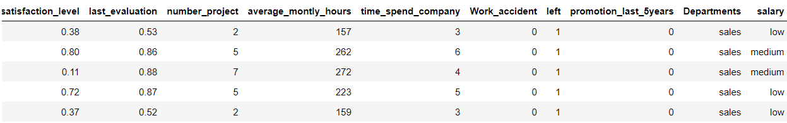
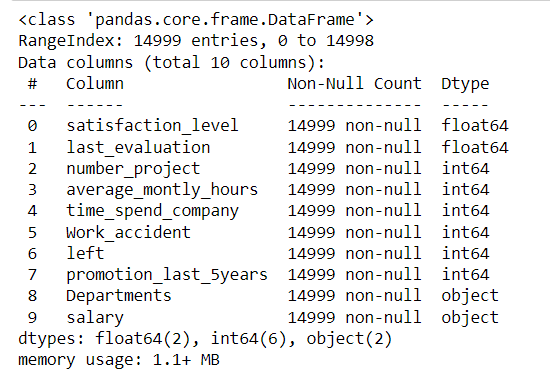
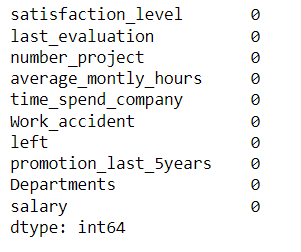
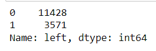
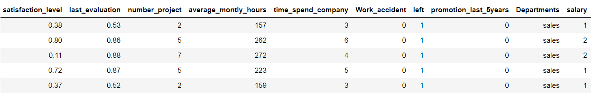
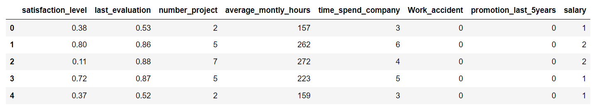
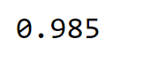
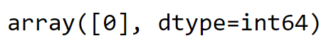

# Implementation-of-Decision-Tree-Classifier-Model-for-Predicting-Employee-Churn

## AIM:
To write a program to implement the Decision Tree Classifier Model for Predicting Employee Churn.

## Equipments Required:
1. Hardware – PCs
2. Anaconda – Python 3.7 Installation / Moodle-Code Runner

## Algorithm
1. Import the standard libraries.
2. Upload the dataset and check for any null values using .isnull() function.
3. Import LabelEncoder and encode the dataset.
4. Import DecisionTreeClassifier from sklearn and apply the model on the dataset. 
5. Predict the values of array.
6. Import metrics from sklearn and calculate the accuracy of the model on the dataset.
7. Predict the values of array.
8. Apply to new unknown values.

## Program:
```
/*
Program to implement the Decision Tree Classifier Model for Predicting Employee Churn.
Developed by: Santhosh M
RegisterNumber: 212220040146

import pandas as pd
data=pd.read_csv("Employee.csv")
data.head()
data.info()
data.isnull().sum()
data["left"].value_counts()
from sklearn.preprocessing import LabelEncoder
le=LabelEncoder()
data["salary"]=le.fit_transform(data["salary"])
data.head()
x=data[["satisfaction_level","last_evaluation","number_project","average_montly_hours","time_spend_company","Work_accident","promotion_last_5years","salary"]]
x.head()
y=data["left"]
from sklearn.model_selection import train_test_split
x_train,x_test,y_train,y_test=train_test_split(x,y,test_size=0.2,random_state=100)
from sklearn.tree import DecisionTreeClassifier
dt=DecisionTreeClassifier(criterion="entropy")
dt.fit(x_train,y_train)
y_pred=dt.predict(x_test)
from sklearn import metrics   
accuracy=metrics.accuracy_score(y_test,y_pred)
accuracy
dt.predict([[0.5,0.8,9,260,6,0,1,2]])
*/
```

## Output:
DATA HEAD


DATA INFO



DATA ISNULL



DATA LEFT




X HEAD



DATA FIT

ACCURACY



PREDICTED VALUES




## Result:
Thus the program to implement the  Decision Tree Classifier Model for Predicting Employee Churn is written and verified using python programming.
